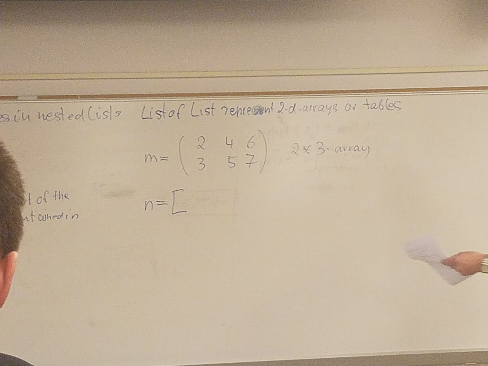

# Notes Friday Week 5

As always the notes are linked [here](https://polylearn.calpoly.edu/AY_2017-2018/pluginfile.php/520751/mod_resource/content/1/csc101stud_chap5Lists.pdf)

So let's just jump into this

## Chapter 5

### 5.2.6 Slices [i]- Slice Operators

```Python
n = [10 ,21 , 13 , 74 , 5 , 6, ,7, 8, ...]
sublist = n[2:5] #[13, 74 , 5]

```

Create a list containing values with index 2,3, and 4

## 5.3 List of Lists - Nested Lists- Arrays- Tables- Matrices

A list of is a sequence of elements or values

```Python
l = [3, 4, 5]

```

Value can also be a list

```Python
m = [[2,4,6] , [3,5,7]]

```
M is a list with two element and each element is a list

```Python
a = m[0] #Reference to the first element of list m
b = a[1] #4
```

State Diagram:
m -> list with two elements [index 1, index 2] both indices are lists
a -> index 0 of m or [2,4,6]
b -> index 1 of a or m[0][1] or 4

Direct access of values in nested lists

```python
b = m[0][1] #1 refers to the outer list and the 1 refers to the inner list of list m

```

List of list represent 2-d arrays or tables



### 5.3.2 List of Lists

```Python
#Solution 1
def display_array(m):
    for r in range(len(m)):
        for c in range(len(m[r])):
            print("%4d" % m[r][c] , end='')
        print()
#Solution 2        
def display_array(m):
    for r in m:
        for c in r:
            print("%4d" % c , end='')
        print()
#Solution 3
def display_array(m):
    for r in range(len(m)):
        row = m[r]
        for c in row:
            print("%4d" % c , end='')
        print()
```

```python
def create_array(rows , cols):
    total_num = rows * col
    m = []
    count = 1
    for r in range(rows):
        n = []
        for col in range(cols):
            n.append(count)
            count+=1
        m.append(n)
    return m
```
